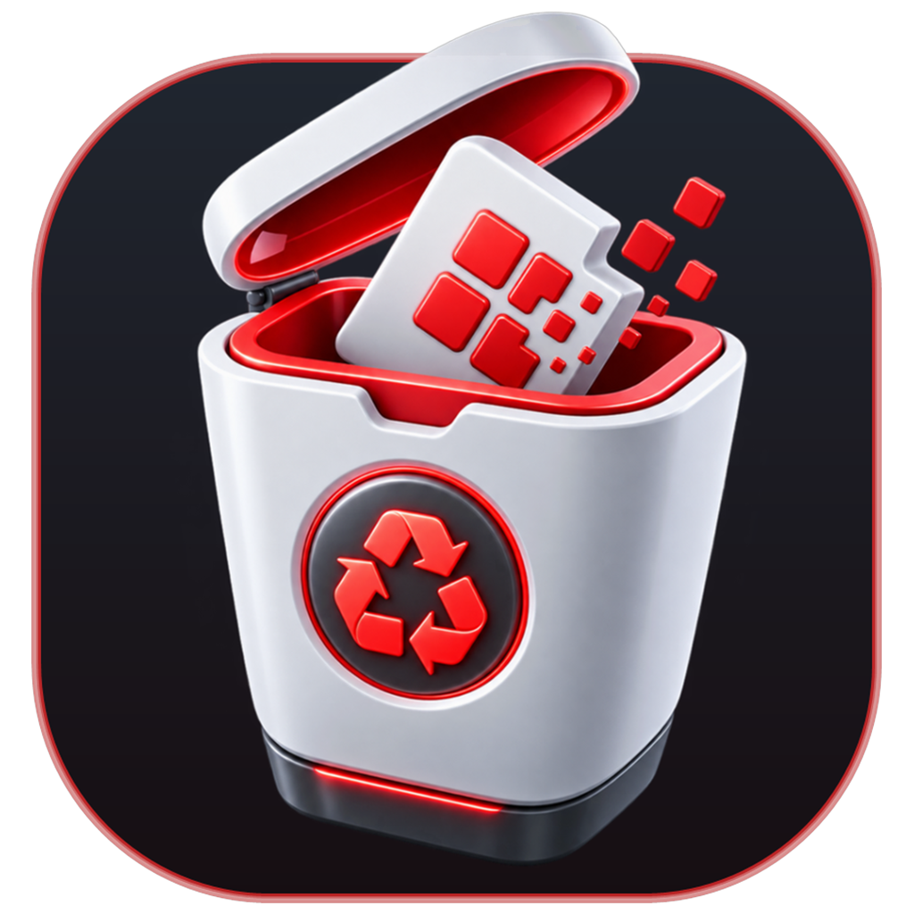

<div align="center">



# Any Uninstaller

**The clean, fast, and effortless batch application uninstaller for Windows.**

[](LICENSE)
[-0078D6?logo=windows)](https://www.microsoft.com/windows)
[](https://avaloniaui.net/)
[](CHANGELOG.md)
[](PRIVACY.md)

[Features](#-key-features) • [Download](#-downloads--distributions) • [Window Targeter](#-window-targeter) • [Build from Source](#-building-from-source) • [Privacy](#-privacy--security) • [Changelog](CHANGELOG.md)

</div>

---

## 💡 What is Any Uninstaller?

**Any Uninstaller** is a modern, high-performance Windows uninstallation utility engineered to remove programs completely, safely, and unattended. Whether uninstalling single desktop applications, batch-removing dozens of software packages in silence, or cleaning up abandoned leftover files and orphaned registry keys, Any Uninstaller provides an intuitive, fluent experience without bloat or telemetry.

---

## ✨ Key Features

### ⚡ Batch & Quiet Uninstallation
- **Unattended Queue:** Select multiple applications and uninstall them sequentially without clicking through dozens of installer wizards.
- **Quiet Mode Detection:** Automatically identifies and triggers silent command switches for Inno Setup, NSIS, MSI, InstallShield, Wise, and custom installers.
- **Stuck Process Guard:** Detects and terminates unresponsive or hanging installer routines automatically.

### 🔍 Comprehensive Software Discovery
- **Standard Win32 & 64-bit Apps:** Reads machine-wide (`HKLM`) and per-user (`HKCU`) registry entries.
- **Microsoft Store (UWP) Packages:** Scans, filters, and removes provisioned modern Windows Store applications.
- **Drive Orphan Scanning (`ScanDrives`):** Deep-scans local volumes to discover unregistered, portable, or corrupted program folders left behind by broken uninstallers.
- **Runtimes & Updates:** Toggle view for DirectX, Visual C++ runtimes, and system components.

### 🎯 Window Targeter (Crosshair Reticle)
- **Drag-and-Drop Targeting:** Drag the reticle over any open application window to identify its install folder and uninstaller instantly.
- **Live Window Readout:** Displays target window title, process name, PID, and executable path in real time.
- **Active Explorer Folder Detection:** Pointing at a Windows Explorer window automatically resolves the directory being viewed.
- **OS Component Whitelist:** Built-in safeguards protect Windows system processes (`explorer.exe`, `dwm.exe`, taskbar, desktop) from accidental actions.

### 🧹 Leftover & Residual Cleanup
- **Directory Footprint Analysis:** Scans and removes leftover installation folders in `Program Files`, `ProgramData`, and `AppData`.
- **Registry Sweep:** Detects and purges abandoned uninstaller registry keys and orphaned entries.
- **Visual Disk Treemap:** Interactive disk space distribution visualization powered by Skia rendering.

### 🎨 Modern Fluent UI
- **Crafted with Avalonia UI:** Native desktop performance with modern dark themes (*Dark Mode, Midnight Blue, OLED Black, Light*).
- **Customizable Layout:** Resizable columns, customizable table headers, toggleable sidebars, and customizable capsule radius.
- **Accurate Category Sidebar:** Real-time badge counters aligned with filtered health states (*Verified, Orphaned, Protected, Store Apps*).

---

## 📦 Downloads & Distributions

Any Uninstaller is distributed in three standalone, self-contained formats:

| Format | Description | Target Use Case |
| :--- | :--- | :--- |
| **Store / MSIX Package** | Modern packaged format with auto-updates and sandbox compliance. | Recommended for everyday Windows users. |
| **Standalone Portable EXE** | Single standalone `.exe` bundle with zero external runtime dependencies. | Flash drives, IT toolkits, and quick diagnostics. |
| **Portable ZIP Archive** | Unpack-and-run directory with all dependencies included. | Portable workflows without installation. |

> Pre-built release binaries are available under [**Releases**](https://github.com/sayandey021/Any-Uninstaller/releases).

---

## 🎯 Window Targeter

The interactive **Window Targeter** allows uninstalling software directly from what you see on your screen:

```
┌───────────────────────────────┬────────────────────────────────┐
│   ⌖  WINDOW TARGETER          │   📁 BROWSE FILESYSTEM         │
│                               │                                │
│   [ ⌖ Click & Drag Target ]   │   [ 📁 Install Directory... ]  │
│                               │                                │
│   Target: Spotify.exe (PID)   │   [ ⚡ App File / Shortcut... ] │
│   Status: ● Ready             │                                │
└───────────────────────────────┴────────────────────────────────┘
```

- Click and drag the crosshair reticle onto any window on your desktop.
- The global cursor synchronizes to a high-contrast target reticle across all monitors.
- Release over an application window to match it against installed software or generate an on-the-fly uninstaller entry.
- Press **ESC** at any time to abort targeting cleanly.

---

## 🛠️ Building from Source

### Prerequisites
- Windows 10 / 11 (64-bit)
- [.NET 10.0 SDK](https://dotnet.microsoft.com/download) (or later)

### Quick Run
```powershell
# 1. Clone repository
git clone https://github.com/sayandey021/Any-Uninstaller.git
cd "Any-Uninstaller"

# 2. Build and launch
./run_avalonia.bat
```

### Build All Distribution Packages
To produce the Standalone EXE, Portable ZIP, and Store MSIX package simultaneously:
```cmd
build_packages.bat
```
Output packages will be created in the `dist/` directory:
- `dist/app/` — Self-contained application binaries
- `dist/exe/AnyUninstaller.exe` — Standalone portable single executable
- `dist/portable/AnyUninstaller-Portable.zip` — Portable zip archive
- `dist/msix/Saayan.AnyUninstaller_x64.msix` — Packaged Windows application

---

## 🏛️ Solution Architecture

The repository is modularized into dedicated engine libraries and a modern Avalonia UI:

```
Any-Uninstaller/
├── source/
│   ├── AnyUninstaller.Avalonia/   # Modern Avalonia UI, ViewModels, and Dialogs
│   ├── UninstallTools/            # Software discovery, registry & Store app scanners
│   ├── UniversalUninstaller/      # Multi-engine uninstaller orchestrator
│   ├── KlocTools/                 # System, P/Invoke, and Win32 interop helpers
│   ├── HelperTools/               # Logging, file system utilities, and primitives
│   └── NetSettingBinder/          # Fast configuration binding engine
├── packaging/                     # MSIX manifest and Store asset packaging templates
├── scripts/                       # Automated PowerShell packaging pipeline
├── build_packages.bat             # One-click master build script
├── run_avalonia.bat               # Development launch script
├── CHANGELOG.md                   # Full release and version history
├── PRIVACY.md                     # Privacy Policy (GDPR / CCPA / Store compliant)
└── LICENSE                        # Apache License 2.0
```

---

## 🛡️ Privacy & Security

- **100% Offline & Private:** Any Uninstaller does not connect to telemetry servers, contains no advertising trackers, and collects zero personal data.
- **Non-Destructive Scanning:** System and registry discovery operate in read-only mode until explicit user confirmation.
- **Safety Safeguards:** Built-in confirmation summaries, optional System Restore Point integration, and system-critical directory protection.
- Read our full [**Privacy Policy**](PRIVACY.md).

---

## 🤝 Contributing

Contributions, bug reports, and feature suggestions are welcome!
1. Fork the repository
2. Create your feature branch (`git checkout -b feature/AmazingFeature`)
3. Commit your changes (`git commit -m 'Add AmazingFeature'`)
4. Push to the branch (`git push origin feature/AmazingFeature`)
5. Open a Pull Request

---

## 📄 License

This project is licensed under the **Apache License 2.0** — see the [LICENSE](LICENSE) file for details.

Original codebase foundation based on BCUninstaller by Marcin Szeniak. Extended, modernized, and maintained by Sayan Dey.

---

## 👤 Author & Support

- **Developer:** Sayan Dey
- **Email:** [saayanstudiosoft@gmail.com](mailto:saayanstudiosoft@gmail.com)
- **GitHub:** [@sayandey021](https://github.com/sayandey021)
- **LinkedIn:** [Sayan Dey](https://www.linkedin.com/in/sayan-dey021)
